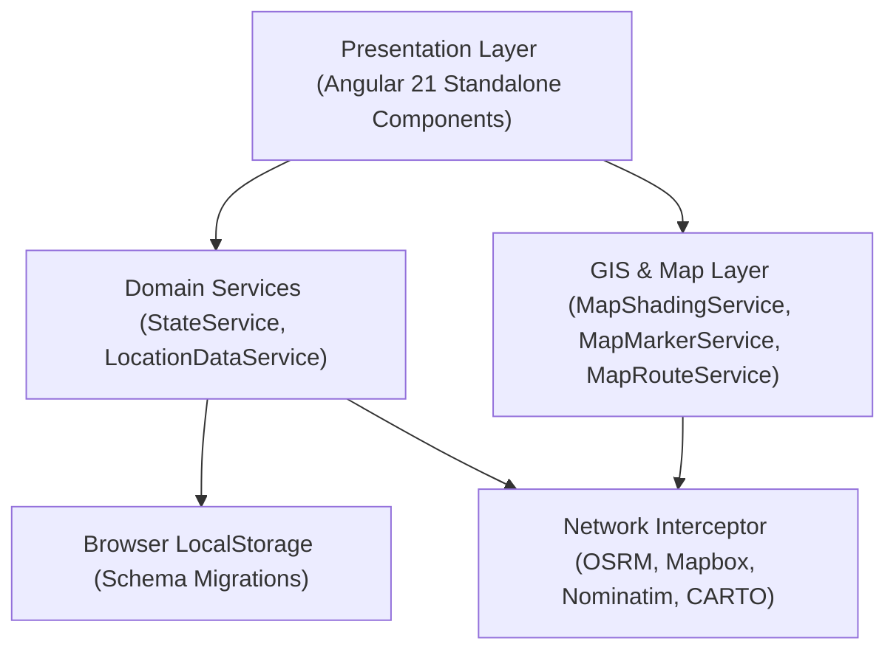

# Traveled Roads Tracker Architecture Portal

The Traveled Roads Tracker application has evolved from a legacy static script into a modern, reactive **Angular 21 Standalone Application** backed by **Leaflet GIS mapping**, **RxJS reactive state streams**, and **browser-local schema persistence**.

> [!IMPORTANT]
> The full architectural specification and deep documentation tree is maintained inside the **[`architecture/`](file:///Users/jacobfisher/coding/traveltracker/travel-tracker-public/architecture/README.md)** directory. Developers and AI agents must reference these guides before starting new features or refactors.

---

## Architectural Document Directory

| Document | Topic | Description |
| :--- | :--- | :--- |
| **[architecture/README.md](file:///Users/jacobfisher/coding/traveltracker/travel-tracker-public/architecture/README.md)** | **Master Index & System Diagram** | High-level topology diagram, module relationships, and quick reference guide. |
| **[01. System Overview](file:///Users/jacobfisher/coding/traveltracker/travel-tracker-public/architecture/01-system-overview.md)** | **Core Framework & Directory Layout** | Angular 21, Vite builder, standalone components, and bootstrap lifecycle. |
| **[02. State & Data Flow](file:///Users/jacobfisher/coding/traveltracker/travel-tracker-public/architecture/02-state-and-data-flow.md)** | **Reactive State & Persistence** | `StateService` observables, `LocalStorageService` schemas, and migration rules. |
| **[03. Map & GIS Architecture](file:///Users/jacobfisher/coding/traveltracker/travel-tracker-public/architecture/03-map-and-gis-architecture.md)** | **Leaflet Engine & Decoupled Services** | `MapViewComponent` orchestrator, `MapShadingService`, `MapMarkerService`, `MapRouteService`, and pure GIS math utilities. |
| **[04. Component Catalog](file:///Users/jacobfisher/coding/traveltracker/travel-tracker-public/architecture/04-component-catalog.md)** | **UI Views & Modal Dialogs** | Contracts and inputs/outputs for `RouteBuilderComponent`, `LocationsTrackerComponent`, and all modals. |
| **[05. External APIs & Network](file:///Users/jacobfisher/coding/traveltracker/travel-tracker-public/architecture/05-external-apis-and-network.md)** | **Network Interceptor & Endpoints** | Tile servers (CARTO/OSM), Nominatim geocoding, OSRM/Mapbox routing, and timeout/retry handling. |
| **[06. Testing & Quality Assurance](file:///Users/jacobfisher/coding/traveltracker/travel-tracker-public/architecture/06-testing-and-quality.md)** | **Vitest, Linting & Build Standards** | Unit testing with mocked Leaflet, Playwright e2e specs, and Makefile commands. |
| **[07. AI Agent Playbook](file:///Users/jacobfisher/coding/traveltracker/travel-tracker-public/architecture/07-ai-agent-playbook.md)** | **Fast Navigation & LSP Protocol** | Benchmarked protocols for `lsp_find_symbol` (0.1s), `ast-grep outline` (0.05s, 95% token savings), and decorator trap warnings. |

---

## High-Level Architecture Diagram

