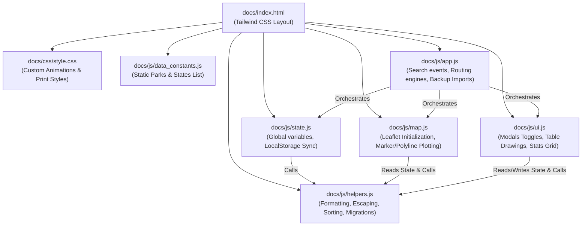
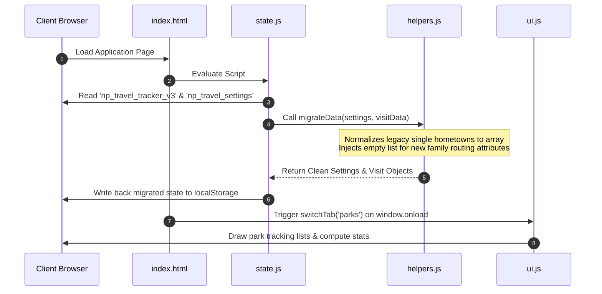
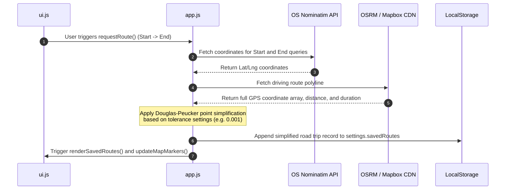

# Application Architecture

The Family Travel Tracker is a client-side static web application that enables families to track national parks, states, and road trips. It executes entirely in the user's browser (serverless static hosting) and persists preferences and trip coordinates locally.

---

## 1. Component Architecture

Following the modularization refactor, the application logic is divided into five logical layers loaded sequentially in `docs/index.html`. This ensures a clear separation of concerns:



### Module Descriptions
*   **[docs/js/helpers.js](file:///Users/jacobfisher/coding/traveltracker/travel-tracker-public/docs/js/helpers.js)**: Holds pure mathematical and formatting functions (e.g. converting geodetic coordinates to distances/times, HTML-escaping to prevent XSS, grouping trip dates, and JSON schema version migration).
*   **[docs/js/state.js](file:///Users/jacobfisher/coding/traveltracker/travel-tracker-public/docs/js/state.js)**: Manages reactive application state. Loads settings and visit records from `localStorage` on startup, invokes migrations, and writes back state changes via the `save()` helper.
*   **[docs/js/map.js](file:///Users/jacobfisher/coding/traveltracker/travel-tracker-public/docs/js/map.js)**: Orchestrates the Leaflet map layer, custom icon layouts (visited vs unvisited visual states), custom popup HTML, and coordinate plotting.
*   **[docs/js/ui.js](file:///Users/jacobfisher/coding/traveltracker/travel-tracker-public/docs/js/ui.js)**: Controls interactive DOM rendering (modals, settings checklists, member filter selectors, table sorts, and stats grids).
*   **[docs/js/app.js](file:///Users/jacobfisher/coding/traveltracker/travel-tracker-public/docs/js/app.js)**: Serves as the central controller. Glues input event listeners, processes OSRM/Mapbox REST requests, geocodes input queries using Nominatim, and manages spreadsheet exports/backup JSON restorations.

---

## 2. Core Workflows

### A. Initialization & Data Migration
When the application starts, it retrieves `localStorage` schemas and normalizes old formats to ensure continuous backward compatibility:



### B. Routing & Point Simplification
The application fetches road-following coordinate geometries from CDNs and simplifies them locally using the Douglas-Peucker algorithm to save storage bandwidth:



---

## 3. Testing Architecture

Since the code is modularized to run natively in static web CDNs via shared global window variables, unit tests in Node.js are emulated using Node's `global` namespace.

*   **Test File**: [tests/app.test.js](file:///Users/jacobfisher/coding/traveltracker/travel-tracker-public/tests/app.test.js)
*   **Emulation Hook**:
    Inside [docs/js/app.js](file:///Users/jacobfisher/coding/traveltracker/travel-tracker-public/docs/js/app.js), Node.js environment detection loads all dependency files (`state.js`, `helpers.js`, `map.js`, `ui.js`) using `require` and mixes their exports into the Node `global` object.
    ```javascript
    if (typeof module !== 'undefined' && module.exports) {
        const state = require('./state.js');
        const helpers = require('./helpers.js');
        const map = require('./map.js');
        const ui = require('./ui.js');
        Object.assign(global, state, helpers, map, ui);
    }
    ```
    This mimics the browser's global scope environment, letting developers write fast local unit tests using the native `node:test` runner.
