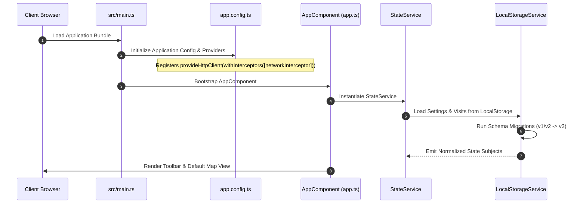

# 01. System Overview

## 1. Technology Stack

| Layer | Technology / Library | Version | Purpose |
| :--- | :--- | :--- | :--- |
| **Framework** | Angular | `21.2.x` | Modern reactive UI framework utilizing Standalone Components. |
| **Build Toolchain** | `@angular/build` (esbuild + Vite) | `21.2.x` | High-speed production bundling and instant dev server rebuilds. |
| **Language** | TypeScript | `^5.9.2` | Strict type safety and AST intelligence. |
| **Reactivity** | RxJS | `7.8.0` | Reactive state streams (`BehaviorSubject`, `Observable`, operators). |
| **Mapping Engine** | Leaflet | `1.9.4` | Interactive mapping, vector layers, and tile rendering. |
| **Styling** | Tailwind CSS | JIT / CDN tokens | Utility-first styling with dynamic color theme tokens. |
| **Testing** | Vitest | `4.1.11` | Instant unit test execution via Angular Vitest runner. |
| **End-to-End** | Playwright | `^1.61.1` | Headless cross-browser regression testing. |
| **Linter & Formatter** | ESLint + Prettier | `10.4.x` / `3.8.x` | Code quality enforcement and automated style formatting. |

---

## 2. Directory Layout & Organization

The codebase strictly enforces modular domain separation:

```text
src/
├── main.ts                               # Browser bootstrap entry point
├── app/
│   ├── app.ts                            # Root shell component & header toolbar
│   ├── app.html                          # Root shell template (toolbar, drawers, modals)
│   ├── app.config.ts                     # Application-level providers & interceptors
│   ├── app.routes.ts                     # App routing (SPA root)
│   │
│   ├── components/                       # Feature components & UI views
│   │   ├── map-view/                     # Leaflet map orchestrator & GIS renderers
│   │   │   ├── components/               # Isolated overlay widgets (legends)
│   │   │   ├── services/                 # Layer rendering services (shading, markers, routes)
│   │   │   └── utils/                    # Pure GIS and popup template utilities
│   │   ├── route-builder/                # Road trip route planning & waypoint management
│   │   ├── locations-tracker/            # Data table of visited parks and states
│   │   ├── global-search/                # Real-time search filter input
│   │   ├── location-autocomplete/        # Nominatim geocoding input autocomplete
│   │   ├── settings-modal/               # Family members, hometowns & API keys modal
│   │   ├── stats-modal/                  # High-level visited statistics modal
│   │   ├── parks-states-modal/           # Dedicated parks and states checklist modal
│   │   ├── location-detail-modal/        # Single location visit logs & member notes modal
│   │   ├── welcome-modal/                # First-run onboarding setup wizard
│   │   └── help-modal/                   # Documentation, FAQ & keyboard shortcuts modal
│   │
│   ├── core/                             # Singleton core services, interceptors & constants
│   │   ├── components/                   # Core UI primitives (toast-container, loading-spinner)
│   │   ├── constants/                    # Immutable geographic data, themes & map styling
│   │   ├── interceptors/                 # Global HTTP network interceptor (retries, timeouts)
│   │   ├── services/                     # App-wide infrastructure (LoggerService, ToastService)
│   │   └── utils/                        # Pure mathematical & GIS algorithmic functions
│   │
│   ├── models/                           # TypeScript interfaces & domain schemas
│   │   ├── location.model.ts             # Geographic point & marker interfaces
│   │   ├── route.model.ts                # Road trip route & waypoint definitions
│   │   └── settings.model.ts             # User settings, family members & visit logs schemas
│   │
│   └── services/                         # Global domain & data services
│       ├── state.service.ts              # Reactive single source of truth (RxJS)
│       ├── local-storage.service.ts      # Local browser persistence & schema migrations
│       ├── location-data.service.ts      # Parks, states and GeoJSON data loader
│       └── routing/                      # OSRM / Mapbox driving route calculation services
│
└── environments/
    └── environment.ts                    # Dynamically generated runtime API keys & config
```

---

## 3. Application Lifecycle & Bootstrap



1. **Bootstrap (`src/main.ts`)**: Invokes `bootstrapApplication(AppComponent, appConfig)` without `NgModule`.
2. **Configuration (`src/app/app.config.ts`)**: Configures `provideHttpClient(withInterceptors([networkInterceptor]))` for timeout and retry resilience.
3. **Environment Injection (`make generate-env`)**: Environment keys (`MAPBOX_API_KEY`, `CARTO_API_KEY`) are dynamically injected into `src/environments/environment.ts` from `.env`.
