# 02. State Management & Data Flow

## 1. Architecture Overview

Traveled Roads Tracker uses a centralized reactive state model built on **RxJS `BehaviorSubject`** streams within [StateService](file:///Users/jacobfisher/coding/traveltracker/travel-tracker-public/src/app/services/state.service.ts). The application executes entirely in the client browser with zero server dependencies, persisting state automatically to `localStorage` via [LocalStorageService](file:///Users/jacobfisher/coding/traveltracker/travel-tracker-public/src/app/services/local-storage.service.ts).

```mermaid
graph LR
    subgraph Storage["Browser LocalStorage"]
        LS_Settings["Key: np_travel_settings"]
        LS_Visits["Key: np_travel_tracker_v3"]
    end

    subgraph StateManagement["StateService (RxJS Reactive Store)"]
        Sub_Settings["settings$ (AppSettings)"]
        Sub_Search["searchTerm$ (string)"]
        Sub_Mode["mapMode$ ('parks'|'states'|'roads')"]
        Sub_Theme["colorTheme$ (ColorThemeId)"]
        Sub_Route["selectedRoute$ (RouteObject | null)"]
        Sub_Edit["editingLocation$ ({id, mode} | null)"]
        Sub_Drawer["detailsDrawerOpen$ (boolean)"]
    end

    subgraph Subscribers["Components (Reactive Consumers)"]
        MapView["MapViewComponent (Rerenders layers)"]
        RouteBuilder["RouteBuilderComponent (Waypoints & routes)"]
        Tracker["LocationsTrackerComponent (Filter tables)"]
        Modals["Settings / Stats / Detail Modals"]
    end

    Storage -->|Load & Migrate on Init| StateManagement
    Subscribers -->|Dispatch Actions| StateManagement
    StateManagement -->|Save State| Storage
    StateManagement -->|Async Pipe / combineLatest| Subscribers
```



---

## 2. The Core State Streams (`StateService`)

| Observable | Type | Description & Usage |
| :--- | :--- | :--- |
| `settings$` | `Observable<AppSettings>` | Family members, hometowns, saved routes, custom API keys, and visited parks/states data. |
| `searchTerm$` | `Observable<string>` | Global search string used across map markers, GeoJSON polygons, and tracking tables. |
| `mapMode$` | `Observable<'parks' \| 'states' \| 'roads'>` | Active visualization mode. Controls zoom bounds, active layers, and legend display. |
| `colorTheme$` | `Observable<ColorThemeId>` | Current theme ID (e.g. `'dunes-deep-lake'`, `'monochrome'`, `'high-contrast'`). |
| `selectedRoute$` | `Observable<RouteObject \| null>` | Route currently inspected or previewed in the road trip route builder. |
| `editingLocation$` | `Observable<{ id: string; mode: string } \| null>` | Location currently open in the `LocationDetailModal` for logging trip dates. |
| `detailsDrawerOpen$` | `Observable<boolean>` | Toggle state of the bottom slide-up data drawer. |

---

## 3. Persistence & Schema Migrations (`LocalStorageService`)

### Storage Keys
- `np_travel_settings`: Holds user configuration (family member identities, home coordinates, route reduction preferences, custom keys).
- `np_travel_tracker_v3`: Holds visit records (legacy visited mappings, trip log entries, timestamps).

### Automated Schema Normalization
[LocalStorageService](file:///Users/jacobfisher/coding/traveltracker/travel-tracker-public/src/app/services/local-storage.service.ts) detects legacy data formats and migrates them in-memory without losing user records:
1. **Single Hometown Migration**: Migrates legacy scalar `hometown: { lat, lng }` into the multi-hometown historical array `hometowns: Hometown[]`.
2. **Family Member ID Normalization**: Ensures all members possess a unique UUID string, color token, and valid name.
3. **Trip Visit Logs**: Normalizes scalar date visits (`dateVisited`) into structured trip logs (`visits: VisitLogEntry[]`) for multi-visit logging.

---

## 4. Location Data Feed (`LocationDataService`)

[LocationDataService](file:///Users/jacobfisher/coding/traveltracker/travel-tracker-public/src/app/services/location-data.service.ts) provides static geographic data streams initialized from `src/app/core/constants/geography.constants.ts`:
- `parks$`: 85+ US and Canadian national parks with exact lat/lng coordinates and countries.
- `states$`: 50 US States and 13 Canadian Provinces/Territories.
- `statesGeoJson$`: GeoJSON multi-polygons for US states and Canadian provinces used by `MapShadingService`.

---

## 5. AI Trip Delta Ingestion (`TripDeltaService`)

To allow external AI assistants (ChatGPT, Gemini, Claude) or programmatic agents to update travel history without clicking dozens of checkboxes in the UI, the application implements the **Trip Delta format**:

### Data Flow
1. **Context-Aware Prompt Generation**: [TripDeltaService](file:///Users/jacobfisher/coding/traveltracker/travel-tracker-public/src/app/services/trip-delta.service.ts) dynamically injects current family member names into an LLM prompt template.
2. **Sanitization & Markdown Stripping**: Extracts JSON from markdown fences (````json ... ````) and conversational text.
3. **Fuzzy Entity Resolution**: Matches park names (tolerant of common typos like "Grand Tentons"), 2-letter state postal codes (`MT`, `WY`), transit cities, and group members (`"all"`).
4. **Incremental State Merging**: Mutates `visitedParks` and `visitedStates` in `StateService.settings$` by appending visit logs without overwriting previous trips.

