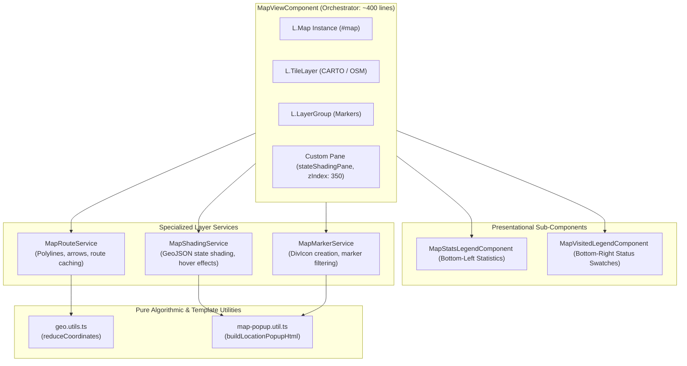

# 03. Map & GIS Architecture

## 1. Map Architecture Overview

The map engine is built on **Leaflet 1.9** and coordinated by [MapViewComponent](file:///Users/jacobfisher/coding/traveltracker/travel-tracker-public/src/app/components/map-view/map-view.component.ts). To maintain high token efficiency, readability, and single-responsibility cohesion, the map subsystem is decoupled into dedicated layer services, presentational sub-components, and pure algorithmic utilities:

---

## 2. Specialized Layer Services

### A. [MapShadingService](file:///Users/jacobfisher/coding/traveltracker/travel-tracker-public/src/app/components/map-view/services/map-shading.service.ts)
- **Role**: Manages GeoJSON multi-polygon vector layers for US States and Canadian Provinces.
- **Dedicated Pane**: Renders into `stateShadingPane` (z-index 350), ensuring polygons sit below interactive markers while remaining fully clickable.
- **Dynamic Shading Rules**:
  - `isAllVisited`: Fill color token `stateVisitedFill`, stroke `stateVisitedStroke`.
  - `isPartiallyVisited`: Fill color token `statePartialFill`, stroke `statePartialStroke`.
  - `unvisited`: Fill color token `stateUnvisitedFill`, stroke `stateUnvisitedStroke`.
- **Interactivity**: Attaches `mouseover` (opacity boost) and `mouseout` listeners, and binds popups via `buildLocationPopupHtml`.

### B. [MapMarkerService](file:///Users/jacobfisher/coding/traveltracker/travel-tracker-public/src/app/components/map-view/services/map-marker.service.ts)
- **Role**: Clears and draws location markers onto the Leaflet `LayerGroup`.
- **Marker Icon Generation**: Creates CSS-styled circular badges via `L.divIcon`:
  - ⛰️ US Parks / 🏔️ Canadian Parks.
  - 🇺🇸 US States / 🇨🇦 Canadian Provinces.
  - 🏠 Active Hometown (blue badge) & Previous Hometowns (gray badges).
- **Filtering**: Automatically filters locations by search term and active `mapMode` (`'parks' | 'states' | 'roads'`).

### C. [MapRouteService](file:///Users/jacobfisher/coding/traveltracker/travel-tracker-public/src/app/components/map-view/services/map-route.service.ts)
- **Role**: Manages road trip polyline rendering, directional arrows, and route bounding box calculations.
- **Route Coordinates Caching**: Caches geometry arrays in-memory to prevent repeated OSRM/Mapbox network calls.
- **Auto-Fit Bounds**: Fits the map viewport to single selected routes or extends the bounding box across all saved routes.

---

## 3. Pure Algorithmic & Template Utilities

### A. [geo.utils.ts](file:///Users/jacobfisher/coding/traveltracker/travel-tracker-public/src/app/core/utils/geo.utils.ts)
Contains pure mathematical GIS algorithms.
- `reduceCoordinates(route: [number, number][], routeReduction: number): [number, number][]`:
  Decimates dense route GPS arrays based on user tolerance while guaranteeing the exact origin and destination coordinates are preserved.

### B. [map-popup.util.ts](file:///Users/jacobfisher/coding/traveltracker/travel-tracker-public/src/app/components/map-view/utils/map-popup.util.ts)
Decouples HTML string generation from the Leaflet component:
- `buildLocationPopupHtml(params, familyMembers)`:
  Constructs sanitize-safe HTML string including:
  - Location title and national park / state badge.
  - Trip visit log badges (e.g. `📅 2 trip visits logged`).
  - Family member visit checklist with dates and green/gray status pills.
  - External Wikipedia link.
  - Edit trigger button: `<button class="edit-location-btn" data-id="..." data-mode="...">✏️ Details</button>`.

---

## 4. Tile Providers & Carto API Configuration

1. **CARTO Voyager Base Layer**:
   Used when an API key is available (`environment.cartoKey` or user custom key):
   `https://{s}.basemaps.cartocdn.com/rastertiles/voyager/{z}/{x}/{y}{r}.png`
2. **OpenStreetMap Fallback**:
   Used when no custom Carto API key is supplied:
   `https://tile.openstreetmap.org/{z}/{x}/{y}.png`
