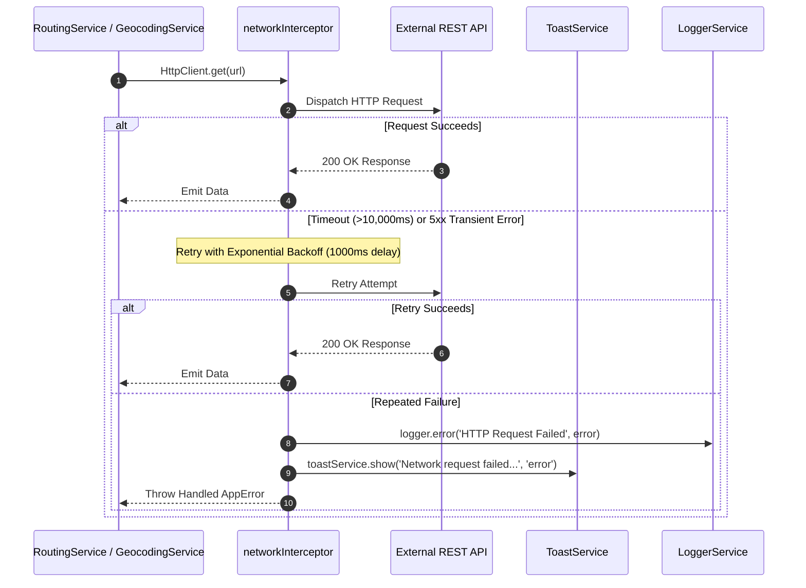

# 05. External APIs & Network Architecture

## 1. Network Interceptor & Resilience (`NetworkInterceptor`)

All outgoing HTTP requests from Angular's `HttpClient` are intercepted by [network.interceptor.ts](file:///Users/jacobfisher/coding/traveltracker/travel-tracker-public/src/app/core/interceptors/network.interceptor.ts). This ensures zero silent failures, automated timeout prevention, and resilient retry behavior.

### Core Configuration
- **Timeout**: Enforced globally via `timeout(environment.networkTimeoutMs || 10000)`.
- **Retries**: Automates 1 retry with exponential delay (`retry({ count: 1, delay: 1000 })`) on 5xx server errors and network dropouts.
- **Error Propagation**: Converts unhandled HTTP errors into structured `AppError` models.

---

## 2. External Service Endpoints

### A. Geocoding API (OpenStreetMap Nominatim)
- **Endpoint**: `https://nominatim.openstreetmap.org/search`
- **Purpose**: Real-time address and city autocomplete for hometowns and road trip waypoints.
- **Service**: [geocoding.service.ts](file:///Users/jacobfisher/coding/traveltracker/travel-tracker-public/src/app/services/routing/geocoding.service.ts)
- **Parameters**: `format=json&limit=5&q={query}`.

### B. Routing Engine: OSRM (Open Source Routing Machine)
- **Endpoint**: `https://router.project-osrm.org/route/v1/driving/`
- **Purpose**: Default free routing provider calculating turn-by-turn road coordinates, total mileage, and drive times.
- **Service**: [routing.service.ts](file:///Users/jacobfisher/coding/traveltracker/travel-tracker-public/src/app/services/routing/routing.service.ts)
- **Parameters**: `overview=full&geometries=geojson`.

### C. Routing Engine: Mapbox Directions API
- **Endpoint**: `https://api.mapbox.com/directions/v5/mapbox/driving/`
- **Purpose**: Optional high-precision routing engine enabled when users supply a Mapbox API token.
- **Parameters**: `geometries=geojson&access_token={token}`.

### D. Map Tile Providers
- **CARTO Voyager**: `https://{s}.basemaps.cartocdn.com/rastertiles/voyager/{z}/{x}/{y}{r}.png` (requires Carto API key).
- **OpenStreetMap Standard**: `https://tile.openstreetmap.org/{z}/{x}/{y}.png` (fallback when no API key is present).
