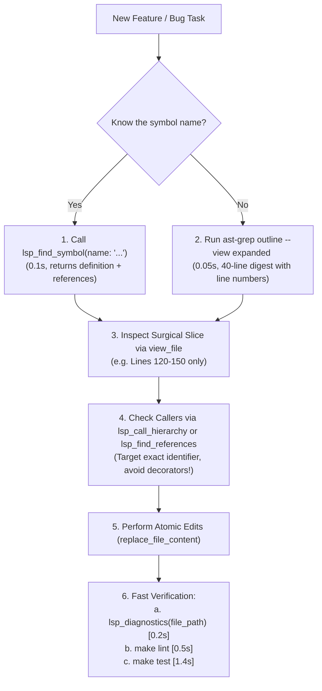

# 07. AI Agent Fast-Navigation Playbook

## 1. Golden Rules for AI Navigation

When working on this repository, AI agents must **never** read entire files blindly or use raw text grepping when navigating unfamiliar code. Doing so consumes tens of thousands of tokens and introduces severe latency.

Follow this benchmarked, high-speed sequence:

---

## 2. Fast Navigation Cheat Sheet

| Task | Tool Call | Command / Parameters | Expected Latency | Token Footprint |
| :--- | :--- | :--- | :--- | :--- |
| **Locate Symbol Definition & Usages** | `lsp_find_symbol` (MCP) | `name: "MapViewComponent"` | **0.1s** | ~25 lines |
| **Inspect File Structure & Line Numbers** | `run_command` | `ast-grep outline --view expanded <file>` | **0.05s** | ~40 lines (**95% savings**) |
| **Inspect Dependencies / Imports** | `lsp_file_imports` (MCP) | `file_path: "..."` | **0.2s** | ~20 lines |
| **Trace Function Call Hierarchy** | `lsp_call_hierarchy` (MCP) | `file_path: "...", line: 120, column: 3` | **0.2s** | ~30 lines |
| **Type Check After Edits** | `lsp_diagnostics` (MCP) | `file_path: "..."` | **0.2s** | ~10 lines |
| **Full Project Type & Syntax Check** | `run_command` | `make lint` | **0.5s** | Terminal output |

---

## 3. The Critical Decorator Trap Warning

> [!CAUTION]
> **NEVER call `lsp_find_references` on framework decorator lines (`@Injectable`, `@Component`, `@Output`)!**
> Doing so instructs the TypeScript language server to search for references to Angular framework decorators across thousands of files in `node_modules`, resulting in a **3-minute stall/timeout**.
>
> **Always use `ast-grep outline` to obtain the exact coordinate of the class name or method identifier** (e.g. `export class StateService` at Line 10, Col 14) before querying references.

---

## 4. Token Efficiency Directives

1. **Surgical `view_file` slices**: Never call `view_file` on a whole 400+ line file. First run `ast-grep outline` to get exact line numbers, then view only the relevant 20–40 line slice.
2. **Decomposition Over Monoliths**: When adding new functionality, create a new sub-component or utility file instead of appending hundreds of lines to an existing file.
3. **Atomic Refactoring**: Refactor definition, update call sites identified by LSP, and immediately verify with `lsp_diagnostics` and `make lint`.
