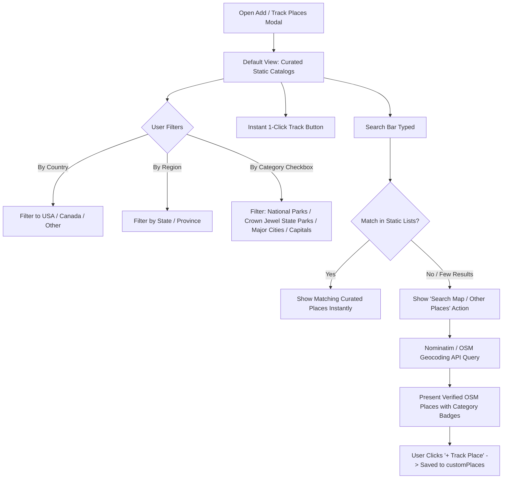

# Travel Tracker: Free-Form Places & Unified "Trip-First" Architecture

> **Design Document (Version 2.2 — Post-Review Revisions & Option A Finalization)**  
> Incorporating user decisions: Countries & regions as reference entities with unique IDs, compact curated Place objects with O(1) lookup, lightweight tag vocabulary list, region-ID transit routes, and Option A approved stop-classification.

---

## 1. Executive Vision: The "Trip-First" Evolution

Travel Tracker is evolving from tracking isolated checkmarks (visited states and national parks) into an immersive travel journaling system where **Trips** become the primary unit of exploration, while preserving the ability to record standalone visits.

### Core Paradigms:
1. **Trips as the Primary Input**:
   - Modern and recent travel happens in **Trips** (start date, end date, destinations, travel corridor stops, travelers, highlights, and notes).
   - Visited places linked to a `tripId` inherit their dates, attendees, and route context automatically.
2. **Standalone Visits Preserved**:
   - Historical visits (places visited years ago where trip itineraries aren't remembered or desired) can still be logged directly as standalone places without requiring a full trip.
3. **Static Curated Reference Entities First**:
   - **Countries & States/Provinces** stay as clean, dedicated static reference entities with unique IDs (`Country`, `Region`).
   - **Curated Places** (National Parks, Crown Jewel State Parks, Key Cities) are pre-baked into formal, compact `Place` objects.
   - When a user tracks a curated place, they reference its permanent `placeId` directly—no need to duplicate static metadata in user storage.
   - Free-form geocoding (OpenStreetMap / Nominatim) is deferred strictly to when a place is not in the curated static catalog.
4. **Option A Stop Classification (Approved)**:
   - Trip stops that are Destinations or Recognized Places (national parks, crown jewel state parks, cities, attractions) automatically generate a `PlaceVisit` entry referencing `tripId`.
   - Pure navigational waypoints (used solely to guide polyline geometry around detours or scenic roads) do NOT clutter passport counts with separate visits.
5. **Lightweight Tag Vocabulary (No DB Reverse Index)**:
   - Keep a simple flat list of all active tags (`tags: string[]`) in settings so the UI can instantly display filter chips and autocomplete suggestions without scanning all visits.
   - When a user filters by a tag, the app scans visits on-demand in memory.
6. **Clean V4 Schema with Explicit Reset Alert**:
   - Rather than accumulating fragile legacy conversion/synthesis layers for past storage schemas, localStorage transitions cleanly to **Schema V4**.
   - If an older schema is encountered, the app displays a clear, friendly alert notifying the user that storage format has been upgraded, and sample presets (`family1.json`) are updated directly to V4.

---

## 2. Data Model Specification (Schema V4)

### 2.1 Reference Entities: Countries & Regions
Countries and States/Provinces are distinct reference entities with unique, permanent IDs:

```typescript
export interface Country {
  id: string;                  // e.g. 'US', 'CA', 'FR', 'JP'
  name: string;                // e.g. 'United States', 'Canada'
  code: string;                // ISO 2-letter code
  pinned?: boolean;            // true for USA & Canada
}

export interface Region {
  id: string;                  // e.g. 'US-CA', 'US-IL', 'CA-AB', 'CA-BC'
  countryId: string;           // References Country.id ('US', 'CA')
  code: string;                // e.g. 'CA', 'IL', 'AB'
  name: string;                // e.g. 'California', 'Illinois', 'Alberta'
}
```

### 2.2 Unified `Place` Model (Curated & Custom)
Every place references its parent `countryId` and optional `regionId`:

```typescript
export type PlaceCategory =
  | 'national_park'
  | 'state_park'
  | 'provincial_park'
  | 'city'
  | 'landmark'
  | 'custom';

export interface Place {
  id: string;                  // e.g. 'us-yosemite', 'sp-starved-rock', 'city-chicago', 'custom-12345'
  name: string;                // e.g. 'Starved Rock State Park'
  category: PlaceCategory;
  countryId: string;           // References Country.id (e.g. 'US', 'CA')
  regionId?: string;           // References Region.id (e.g. 'US-IL', 'CA-AB')
  lat: number;
  lng: number;
  source: 'static' | 'user' | 'osm';
  
  // Optional compact flags for curated lists
  isCurated?: boolean;         // True for static catalog places
  isCapital?: boolean;         // National or state/provincial capital
  isMajorCity?: boolean;       // Curated key city tier
  tags?: string[];             // e.g. ['hiking', 'camping', 'scenic']
}
```

### 2.3 Curated Static Catalog & Lookup Mechanism
Pre-baked places are loaded once into an in-memory registry:

```typescript
// Fast O(1) lookup map in memory:
export const STATIC_PLACES_CATALOG: Place[] = [ ... ];
export const STATIC_PLACES_MAP = new Map<string, Place>(
  STATIC_PLACES_CATALOG.map((p) => [p.id, p])
);
```
- **Storage Efficiency**: When a user marks Yosemite or Chicago as visited, their `placeVisits` simply stores `{ placeId: 'us-yosemite', memberId: 'm-1', ... }`. The place's name, coordinates, category, and region are read directly from `STATIC_PLACES_MAP` without bloating user storage.
- Only net-new, user-added spots (from OSM or manual input) are stored in `customPlaces: Place[]`.

### 2.4 Lightweight Tag Store
Per user feedback, we do not build a complex reverse index (`tag -> placeId[]`):

```typescript
// Stored in AppSettings:
tags: string[]; // e.g., ['camping', 'hiking', 'scenic', 'historic', 'beach']
```
- Provides an instant list of all tags for UI filter chips, autocomplete, and tag clouds without scanning visits.
- When a user selects a tag (e.g. "hiking"), the app filters visits/places on the fly in memory.

### 2.5 The "Trip" Entity & Option A Stop Classification
Trips represent journeys with dates, companions, highlights, and mapped corridors:

```typescript
export interface TripStop {
  placeId: string;             // References Place.id (curated or custom)
  name: string;
  lat: number;
  lng: number;
  stopType: 'destination' | 'corridor_stop';
  isWaypointOnly?: boolean;    // If true, route waypoint only without logging PlaceVisit (Option A)
  arrivalDate?: string;
  notes?: string;
}

export interface Trip {
  id: string;
  name: string;                // e.g. 'Pacific Northwest Summer Expedition'
  startDate: string;           // ISO YYYY-MM-DD
  endDate: string;             // ISO YYYY-MM-DD
  travelerIds: string[];       // Family member IDs on this trip
  destinations: TripStop[];    // Primary overnight or major stay destinations
  corridorStops?: TripStop[];  // Waypoints, state parks, or scenic stops
  transitRegionIds?: string[]; // Region IDs driven through (e.g. ['US-WY', 'US-SD'])
  highlights?: string[];       // Key moments/highlights logged by user or AI
  notes?: string;
  coordinates?: [number, number][]; // Routing geometry polyline
  distanceMiles?: number;
  color?: string;
}
```
*(Note: `transitRegionIds` references standard `Region.id`s, allowing clean boundary shading and transit stats).*

### 2.6 Unified `PlaceVisit` (Trip-Linked or Standalone)
```typescript
export interface PlaceVisit {
  placeId: string;             // References curated Place.id or custom Place.id
  memberId: string;
  status: 'visited' | 'want_to_visit';
  
  // Trip linkage (primary for modern travel)
  tripId?: string;             // References Trip.id. Inherits trip dates & companions
  
  // Standalone fields (for historical visits or manual overrides)
  dateVisited?: string;        // Optional date if standalone
  notes?: string;              // Optional memories/notes
  tags?: string[];             // Optional tags assigned to this visit
}
```

### 2.7 AppSettings V4 Schema
```typescript
export interface AppSettings {
  schemaVersion: 4;
  familyMembers: FamilyMember[];
  hometowns: Hometown[];
  
  // Core Entities
  trips: Trip[];
  customPlaces: Place[];       // Only user-added/OSM-resolved places
  placeVisits: Record<string, PlaceVisit[]>; // placeId -> PlaceVisit[]
  tags: string[];              // Known tag vocabulary list
  
  // App Config
  colorTheme?: string;
  routingEngine: 'osrm' | 'mapbox';
  routeReduction: number;
}
```

---

## 3. Storage Migration Strategy: Clean V4 & Reset Alert

### 3.1 Handling Previous Storage Versions
Rather than maintaining brittle dual-read conversion scripts:
1. When `LocalStorageService` loads data without `schemaVersion === 4`:
   - Trigger a user notification / modal alert:
     > *"Welcome to Travel Tracker V4! We have upgraded our data architecture to a unified Trip and Places model. Your local temporary preview data has been refreshed. Future releases will provide automatic file migration tools for older exports."*
   - Reset localStorage to the default V4 structure.
2. Update sample presets (`docs/examples/family1.json` and `public/examples/family1.json`) directly to Schema V4 with pre-configured sample trips, places, and visits.

---

## 4. UI Flow: Static Curated Lists First, Free-Form Search Secondary

To keep data consistent, fast, and high-quality, the place tracking interface follows a **"Static First, Map Secondary"** design.



### 4.1 Granular Filter Controls in Add Modal
- **Country Selector**: Pinned USA and Canada at top, followed by world countries.
- **Region / State Selector**: Dynamically populated based on chosen country.
- **Category Filter Toggles (Checkboxes / Chips)**:
  - `[x] National Parks`
  - `[x] State & Provincial Parks` (Curated Crown Jewels)
  - `[x] Major Cities`
  - `[x] Capitals Only` (Country & State capitals)
- **Search Box**: Fast local client-side filter over the static collections.
- **Fallback Action**: Below local results: *"Didn't find what you're looking for? [🔍 Search OpenStreetMap for other spots]"*.

---

## 5. Route Corridors & Stop Classification

### 5.1 Manual Trip Builder Stop Classification (Option A)
When creating or editing a Trip manually:
- **Destination Stops**: Primary overnight or major stay locations. Always pinned on map and automatically logged as a `PlaceVisit` linked to `tripId`.
- **Corridor Stops**: Scenic detours, state parks, or restaurants along the driving corridor.
  - **Recognized Places / Attractions**: Automatically logged as a `PlaceVisit` linked to `tripId`.
  - **Waypoints Only** (`isWaypointOnly: true`): Raw routing points used to shape the polyline geometry; do NOT clutter passport counts with separate visits.
- **Transit Regions**: States/provinces (`transitRegionIds`) that the route line intersects. A prompt gives the user a toggle:
  - `[ ] Mark transit states as driven through` (shade lightly without cluttering visited pins).

### 5.2 AI Trip Assistant Stop Classification
When interacting with the AI Trip Assistant (`TripDeltaService` / AI Import):
- **User Prompt Guidance**: The AI modal explicitly guides the user:
  > *"Tell us about your trip! Please mention your **start and end dates**, your **start and end locations**, who traveled with you, and any **key highlights or stops along the way**."*
- **AI Structured Extraction**: The LLM parses the narrative into:
  1. `startDate` & `endDate`.
  2. `travelers`.
  3. `destinations` (primary anchors).
  4. `highlights` (e.g., *"Hiked the rim trail at sunset"*, *"Stayed at historic lodge"*).
  5. `corridorStops` (identified parks, towns, or scenic spots along the route).
- **Iterative Map Enrichment**:
  - The app validates extracted locations against our static catalog first; if a highlight is a local attraction not in static data, the geocoder is iteratively queried to obtain exact coordinates.

---

## 6. Curated Static Datasets

### 6.1 Reference Countries & Regions
- `GLOBAL_COUNTRIES`: ~195 sovereign nations with **USA** and **Canada** permanently pinned at top.
- `REGIONS`: All US states and Canadian provinces/territories with clean IDs (`US-CA`, `US-NY`, `CA-ON`).

### 6.2 Curated "Key Cities" Dataset
- All 50 US State Capitals + top 3 major metro areas per state.
- All 13 Canadian Provincial/Territorial Capitals + major metros.
- Major world capitals and tourist hubs (London, Paris, Tokyo, Rome, etc.).
- Formatted as `Place` objects with `isCapital: true` and `isMajorCity: true`.

### 6.3 Curated "Crown Jewels" State & Provincial Parks
- ~8–10 of the most famous, heavily visited state parks per US state (e.g., Adirondack, Custer, Starved Rock, Valley of Fire, Anza-Borrego).
- Top provincial parks in Canada (e.g., Algonquin, Kananaskis, Pacific Rim).
- Formatted as `Place` objects with `category: 'state_park' | 'provincial_park'`.

---

## 7. Phased Implementation Roadmap & Governance Rules

> [!IMPORTANT]
> **Strict Governance Rule**: The AI agent **MUST STOP** at the conclusion of each phase and prompt the user for explicit review and sign-off before proceeding to the next phase. No skipping ahead.

### Phase 1: Clean V4 Data Model & Storage Reset
- Define Schema V4 interfaces (`Country`, `Region`, `Place`, `Trip`, `PlaceVisit`, `AppSettings`).
- Implement clean localStorage reset alert when pre-V4 data is detected.
- Update `docs/examples/family1.json` and `public/examples/family1.json` to V4 format.
- Add unit tests for V4 settings and storage handling.
- **STOP & PROMPT USER FOR REVIEW.**

### Phase 2: Static Datasets & Catalog Map Store
- Integrate `Country`, `Region`, Curated Cities, and "Crown Jewels" State/Provincial Parks in `geography.constants.ts`.
- Set up `STATIC_PLACES_CATALOG` and `STATIC_PLACES_MAP` for instant O(1) metadata lookups.
- Implement tag vocabulary management (`tags: string[]`).
- Add unit tests validating dataset integrity and filter speed.
- **STOP & PROMPT USER FOR REVIEW.**

### Phase 3: Add / Track Places Modal Overhaul (Static First, Map Secondary)
- Redesign modal with **Static Curated Lists First**:
  - Country, State, Capitals, and Major Cities filter chips.
  - 1-click status cycling and tracking.
- Add secondary "Search Map (OSM)" workflow for free-form lookup.
- **STOP & PROMPT USER FOR REVIEW.**

### Phase 4: Trip-Centric Mapping & Route Corridors
- Migrate Routes to `Trip` model in MapView and RouteBuilder.
- Implement 3-tier stop classification (`destination`, `corridor_stop`, `transit_region`).
- Support deriving visit dates and companions from parent trips.
- **STOP & PROMPT USER FOR REVIEW.**

### Phase 5: AI Trip Assistant Enhancements
- Update AI prompt template to guide users for dates, anchors, and highlights.
- Implement iterative map enrichment for unstructured narrative highlights.
- End-to-end testing and validation.
- **STOP & PROMPT USER FOR FINAL PROJECT SIGN-OFF.**
