# Travel Tracker Architecture Documentation

Welcome to the central architectural documentation for **Traveled Roads Tracker**. This documentation tree provides a comprehensive, structured reference for developers and AI agents before starting any new feature, bug fix, or refactoring task.

---

## Architecture Document Index

| Document | Focus & Scope | Primary References |
| :--- | :--- | :--- |
| **[01. System Overview](file:///Users/jacobfisher/coding/traveltracker/travel-tracker-public/architecture/01-system-overview.md)** | Technology stack, Angular 21 standalone components, project directory structure, and runtime entry points. | `src/main.ts`, `src/app/app.ts`, `angular.json` |
| **[02. State & Data Flow](file:///Users/jacobfisher/coding/traveltracker/travel-tracker-public/architecture/02-state-and-data-flow.md)** | Reactive state management (`StateService`), schema persistence (`LocalStorageService`), data feeds (`LocationDataService`), and backward-compatible schema migrations. | `src/app/services/` |
| **[03. Map & GIS Architecture](file:///Users/jacobfisher/coding/traveltracker/travel-tracker-public/architecture/03-map-and-gis-architecture.md)** | Leaflet map engine, the `MapViewComponent` orchestrator, modular layer services (`MapShadingService`, `MapMarkerService`, `MapRouteService`), and pure GIS math utilities. | `src/app/components/map-view/` |
| **[04. Component Catalog](file:///Users/jacobfisher/coding/traveltracker/travel-tracker-public/architecture/04-component-catalog.md)** | Catalog of top-level views, overlay widgets, drawers, and modal dialogs with input/output contracts. | `src/app/components/` |
| **[05. External APIs & Networking](file:///Users/jacobfisher/coding/traveltracker/travel-tracker-public/architecture/05-external-apis-and-network.md)** | Map tiles (CARTO/OSM), Nominatim geocoding, OSRM/Mapbox routing, and the global HTTP network interceptor. | `src/app/core/interceptors/` |
| **[06. Testing & Quality Assurance](file:///Users/jacobfisher/coding/traveltracker/travel-tracker-public/architecture/06-testing-and-quality.md)** | Vitest unit test suite, Playwright browser tests, ESLint flat config, Prettier, and Makefile commands. | `Makefile`, `vitest` |
| **[07. AI Agent Fast-Navigation Playbook](file:///Users/jacobfisher/coding/traveltracker/travel-tracker-public/architecture/07-ai-agent-playbook.md)** | Benchmarked LSP and AST-grep navigation protocols, token-efficient file exploration, and decorator trap prevention. | `AGENTS.md` |

---

## High-Level System Architecture Diagram

```mermaid
graph TD
    subgraph UI_Layer["Presentation Layer (Angular 21 Standalone)"]
        AppComp["App Component (Root Shell & Toolbar)"]
        MapView["MapViewComponent (Orchestrator)"]
        StatsLegend["MapStatsLegendComponent"]
        VisitedLegend["MapVisitedLegendComponent"]
        RouteBuilder["RouteBuilderComponent"]
        Tracker["LocationsTrackerComponent"]
        Modals["Modals (Settings, Stats, Parks/States, Detail, Welcome)"]
    end

    subgraph Service_Layer["Domain & Map Services Layer"]
        StateSvc["StateService (RxJS Reactive State)"]
        LocDataSvc["LocationDataService (Parks & States Data)"]
        ShadingSvc["MapShadingService (GeoJSON Polygons)"]
        MarkerSvc["MapMarkerService (Leaflet DivIcons & Filters)"]
        RouteSvc["MapRouteService (Polylines & Bounds Fitting)"]
        RoutingEngine["RoutingService (OSRM / Mapbox Client)"]
        Logger["LoggerService (Structured Logging)"]
    end

    subgraph Core_Utils["Core Utilities & Pure Functions"]
        GeoUtils["geo.utils.ts (reduceCoordinates)"]
        PopupUtil["map-popup.util.ts (buildLocationPopupHtml)"]
        ThemeConst["theme.constants.ts"]
        GeoConst["geography.constants.ts"]
        MapConst["map.constants.ts"]
    end

    subgraph Storage_Network["Persistence & External Services"]
        Storage["LocalStorageService (Local Browser DB)"]
        Interceptor["NetworkInterceptor (Retries & Timeouts)"]
        TileServers["Map Tiles (CARTO / OpenStreetMap)"]
        RoutingAPIs["Routing APIs (OSRM / Mapbox / Nominatim)"]
    end

    AppComp --> MapView
    AppComp --> RouteBuilder
    AppComp --> Tracker
    AppComp --> Modals

    MapView --> StatsLegend
    MapView --> VisitedLegend
    MapView --> ShadingSvc
    MapView --> MarkerSvc
    MapView --> RouteSvc
    MapView --> GeoUtils

    ShadingSvc --> PopupUtil
    MarkerSvc --> PopupUtil

    MapView --> StateSvc
    RouteBuilder --> StateSvc
    Tracker --> StateSvc
    Modals --> StateSvc

    StateSvc --> Storage
    RoutingEngine --> Interceptor
    Interceptor --> RoutingAPIs
    MapView --> TileServers
```

---

## Documentation Tree Usage Guide
1. **Consult before implementing**: Review the relevant layer document before making changes (e.g. state management, GIS, component catalog).
2. **AI Agent Governance**: For binding AI agent navigation protocols, refactoring standards, and harness rules, see [AGENTS.md](file:///Users/jacobfisher/coding/traveltracker/travel-tracker-public/AGENTS.md).
3. **Verify with automated toolchains**: Always execute `make test` and `make lint` prior to completing work.
