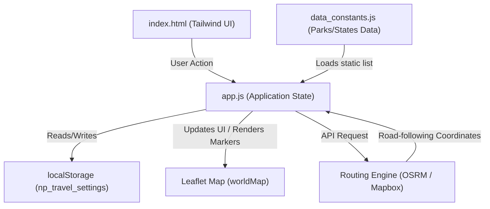
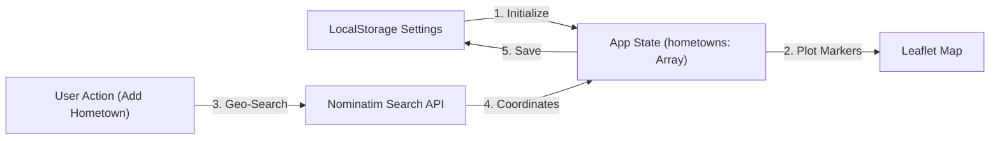

# Architecture Diagrams

This document contains Mermaid-based architecture diagrams illustrating the components and state flow of the Family Travel Tracker.

## Component Interaction Flow

The frontend application operates locally, loading static constants, reading/writing settings to `localStorage`, rendering markers on a Leaflet map, and fetching road paths from public/private routing engines.

## State & Data Flow (Hometowns & Routes)

