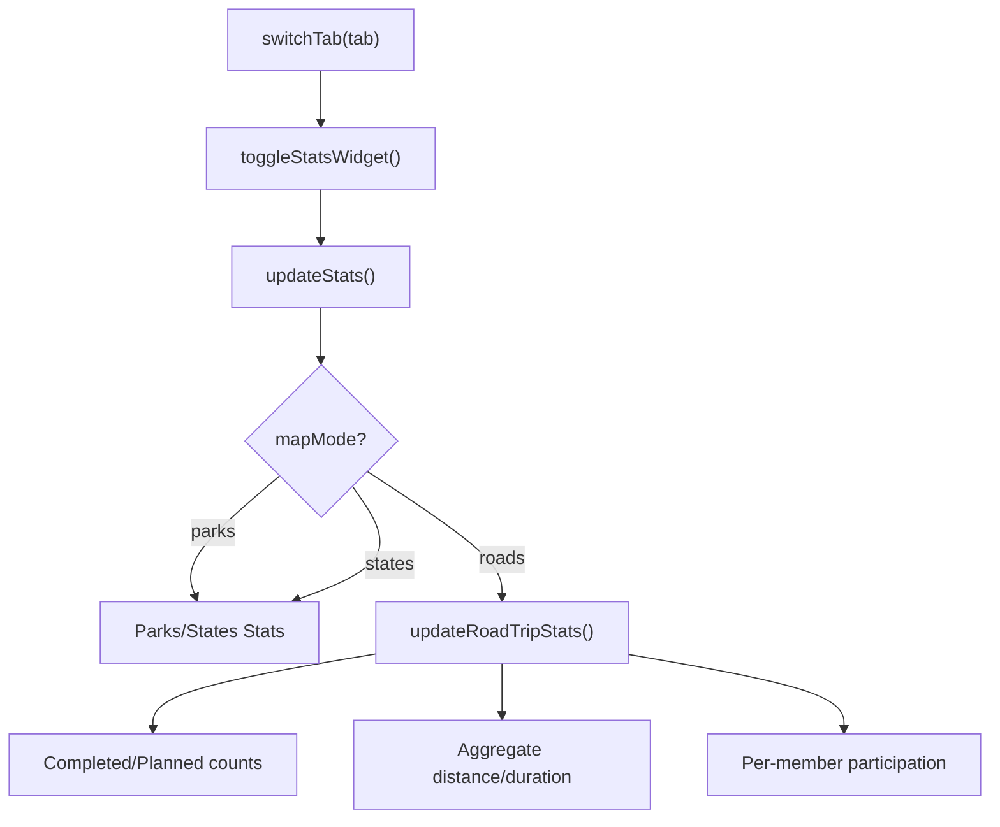

# Diagrams - Road Trip Statistics Fix

## Stats Widget Flow by Map Mode

```mermaid
flowchart TD
    A["switchTab(tab)"] --> B["toggleStatsWidget()"]
    B --> C["updateStats()"]
    C --> D{mapMode?}
    D -->|parks| E["Parks/States Stats"]
    D -->|states| E
    D -->|roads| F["updateRoadTripStats()"]
    F --> G["Completed/Planned counts"]
    F --> H["Aggregate distance/duration"]
    F --> I["Per-member participation"]
```

---
*Written with the assistance of Google Gemini*
