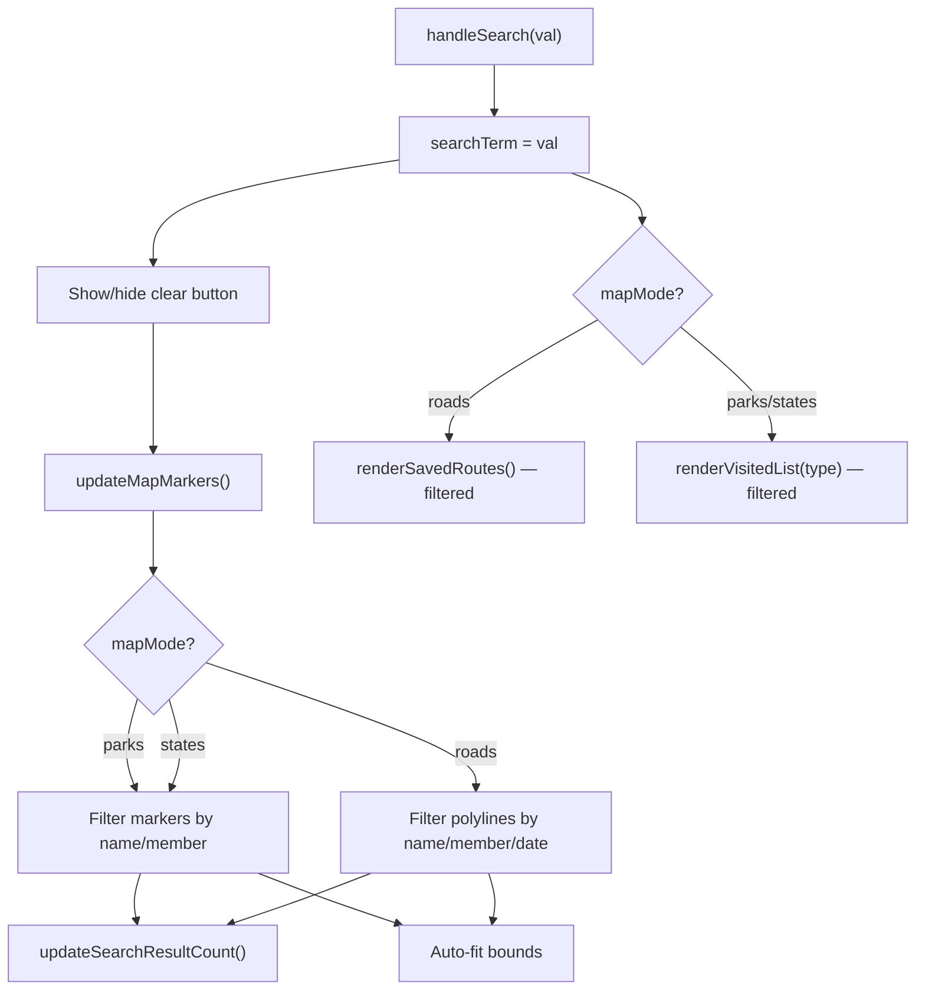
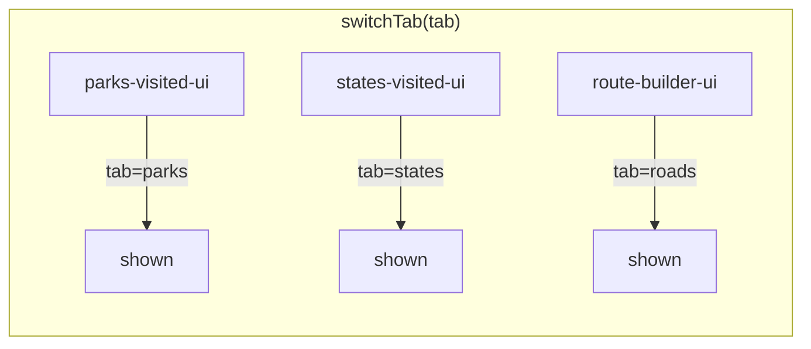
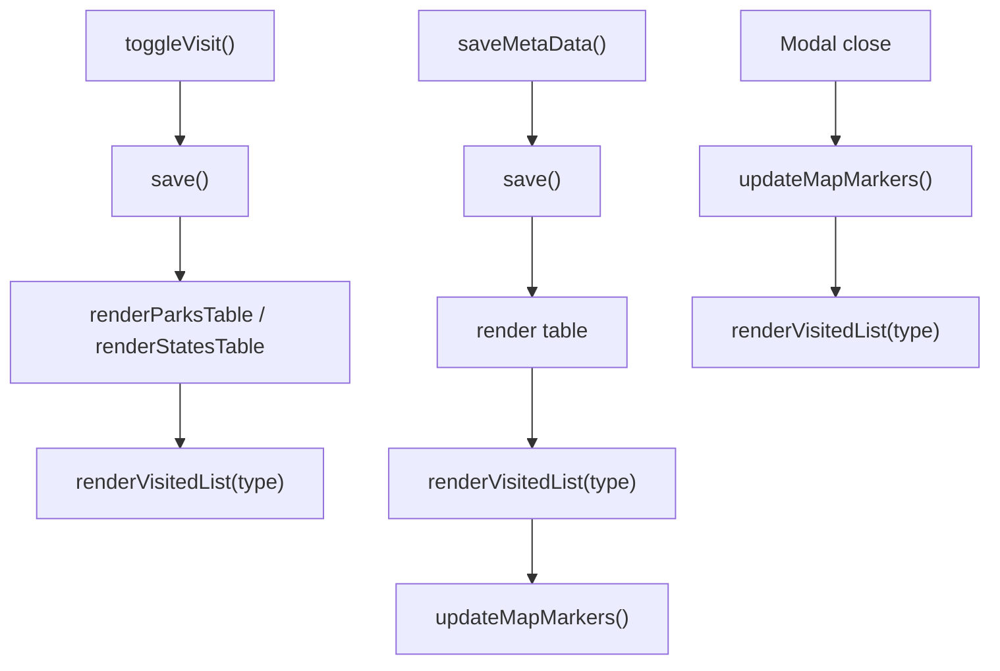

# Diagrams - UI Polish & Search

## Search Dispatch Flow

```mermaid
flowchart TD
    A["handleSearch(val)"] --> B["searchTerm = val"]
    B --> C["Show/hide clear button"]
    C --> D["updateMapMarkers()"]
    D --> E{mapMode?}
    E -->|parks| F["Filter markers by name/member"]
    E -->|states| F
    E -->|roads| G["Filter polylines by name/member/date"]
    F --> H["updateSearchResultCount()"]
    G --> H
    F --> I["Auto-fit bounds"]
    G --> I
    B --> J{mapMode?}
    J -->|roads| K["renderSavedRoutes() — filtered"]
    J -->|parks/states| L["renderVisitedList(type) — filtered"]
```

## Below-Map Panel Visibility

```mermaid
flowchart LR
    subgraph "switchTab(tab)"
        direction TB
        P["parks-visited-ui"] -->|"tab=parks"| SHOW1["shown"]
        S["states-visited-ui"] -->|"tab=states"| SHOW2["shown"]
        R["route-builder-ui"] -->|"tab=roads"| SHOW3["shown"]
    end
```

## Data Sync on User Actions

```mermaid
flowchart TD
    A["toggleVisit()"] --> B["save()"]
    B --> C["renderParksTable / renderStatesTable"]
    C --> D["renderVisitedList(type)"]

    E["saveMetaData()"] --> F["save()"]
    F --> G["render table"]
    G --> H["renderVisitedList(type)"]
    H --> I["updateMapMarkers()"]

    J["Modal close"] --> K["updateMapMarkers()"]
    K --> L["renderVisitedList(type)"]
```

---
*Written with the assistance of Google Gemini*
