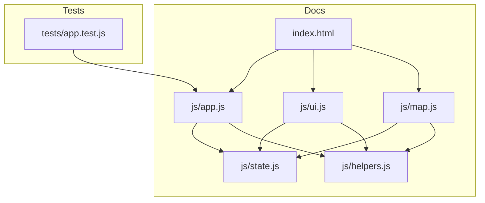

# Architectural & State Diagrams - Session 6

This diagram illustrates the structure of the Javascript codebase components being refactored, highlighting the state dependencies and helper utilities.

